# Easy Timers App

## Table of Contents

* [Motivation](#motivation)
* [Design goals](#design-goals)
* [Getting started and Installing](#getting-started)
* [Basic terms](#basic-terms)
* [Design details](#design-details)
* [Basic terms](#basic-terms)
  * [Data organization](#data-organization)
  * [Screens](#screens)
  * [View (display) functionalities](#view-functionality)
* [Screenshots](#screenshots)
* [TODO list](#todo)

## Motivation <a id="motivation"></a>

As a Computer Science student, I was constantly looking for ideas to apply the knowledge that I’ve leant throughout my years of study. In order to do that, I mainly used observations throughout my daily life. I noticed that my dad utilized the same set of timers during his physical therapy sessions, and my brother always repeated the same routines during his time in the gym. To help streamline these activities, I wanted to create something that helped with the efficiency of these activities. 

## Design goals <a id="design-goals"></a>

The main idea of the design was to create different lists of timers known as “sequences” that are customizable and pre-set for different activities. Each sequence would contain a list of timers of various lengths that run either from start to end or from a chosen start point somewhere in the middle. These sequences run automatically as the user needs no input.

## Getting started and Installing <a id="getting-started"></a>

This app uses React Native and Expo platform. To get started Node.js needs to be installed on your machine. Clone the project and install all required Node.js  modules by running ```npm install```. After that use ```npm start``` to launch this application. Depending on real device or emulation you may need to have Android studio also installed to tun the application.

## Basic terms <a id="basic-terms"></a>

* Timer sequence – Object that contains a timer list
* Timer list with in a sequence – Object that contains one or more timer objects in a set order with varying intervals
* Timer instance in timer list – Object that has an hour, minute, and second value. Has the capability of counting down, pausing, and resetting. 

## Design details <a id="design-details"></a>

### Data organization <a id="data-organization"></a>

The main source of data is a list of Timer sequence objects in <span style="color:CornflowerBlue">main.js</span>, which stores all objects that contain a sequence name and a timer list. Each timer list contains a list of timer objects that store a name, hour, minute, and second values. 

### Screens <a id="screens"></a>

The app’s interface has two items
* Header
* Main screen

The main screen can switch between three components:
* Edit Sequence
* View Sequence
* Play Sequence.

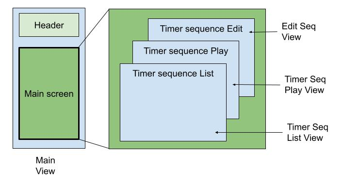

The default screen is the View Sequence screen, where you can swipe right on a sequence and press the edit button to go to the Edit Sequence screen. Pressing directly on a sequence on View Sequence takes you to the Play Sequence. From Edit Sequence and Play Sequence, you can go back to View Sequence, but you cannot go from Edit Sequence and Play Sequence directly.

### View (display) functionalities – Putting data and screen together <a id="view-functionality"></a>
 <br>

**View sequence** displays the list of all the sequences

**Edit Sequence** and **Play Sequence** takes one particular sequence from the list of sequences, and displays the timer list in those screens. Edit Sequence can edit the values of each timer value in the Timer List, and Play Sequence can play the timers either from the start or a certain point in the list. 

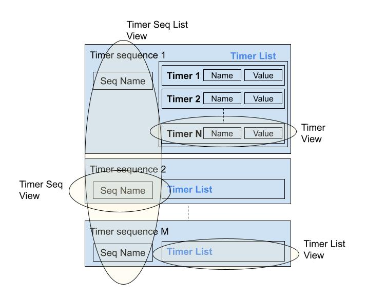


## Screenshots <a id="screenshots"></a>

### Home Screen
<p float="left">
  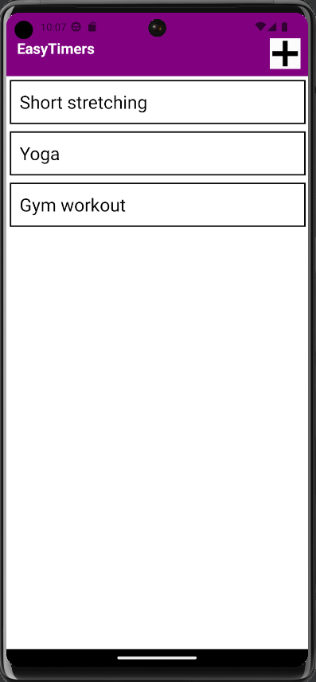
</p>

### Add New Sequence
<p float="left">
  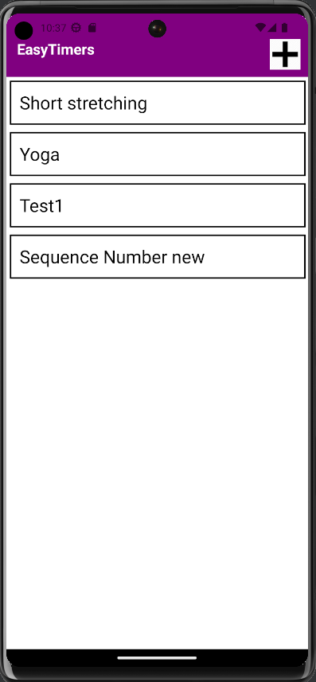
</p>

### Edit Sequence
<p float="left">
  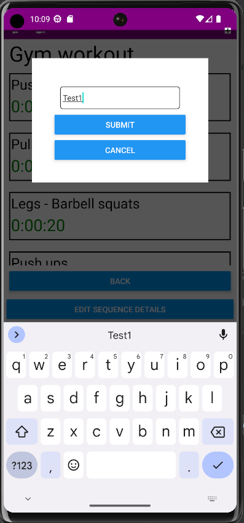
  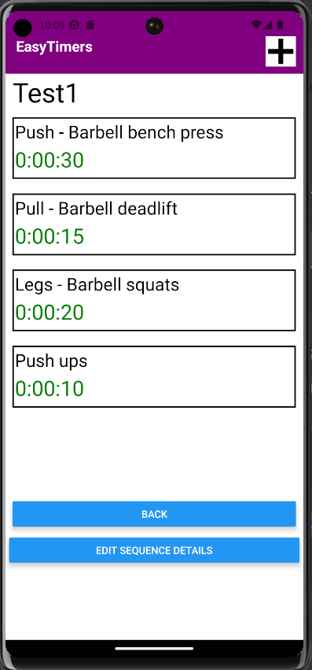 
</p>
<p float="left">
  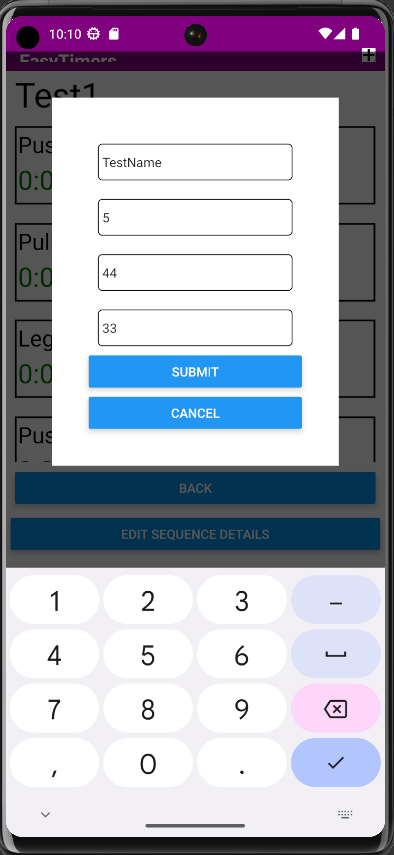
  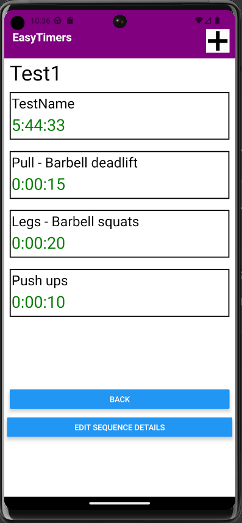 
</p>

### Play Sequence (Landing, Playing, Pause)
<p float="left">
  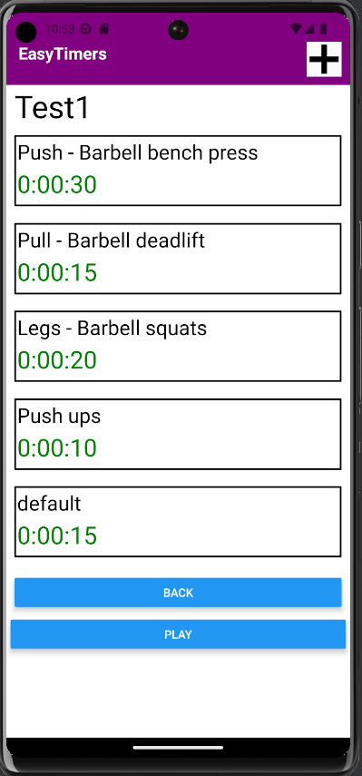
  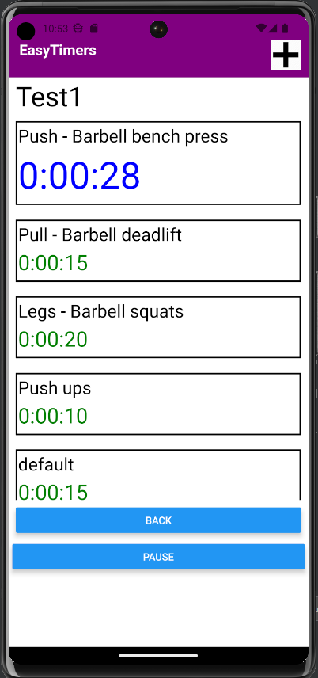 
  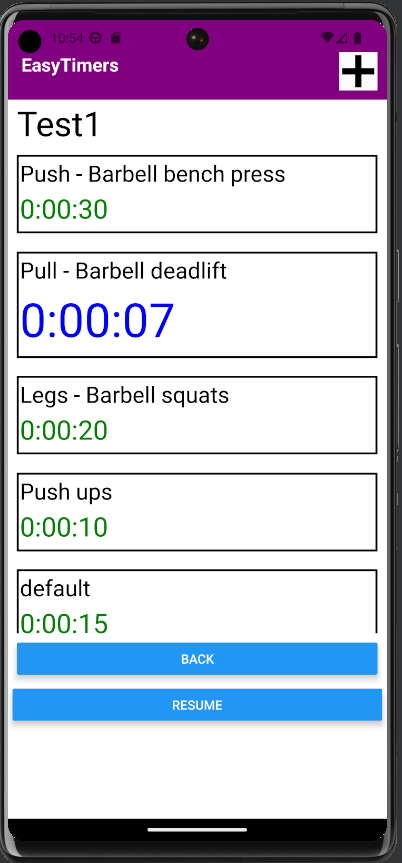 
</p>

## TODO list <a id="todo"></a>

* Save data to local device storage
* Create google signon to save data into cloud for seamless usage across multiple devices
* Add back ground music
* Announce timer sequnce and name that is starting to play
* Add sharing of sequence from other user when operating with google sign in mode
